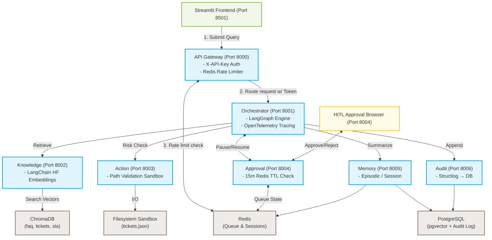
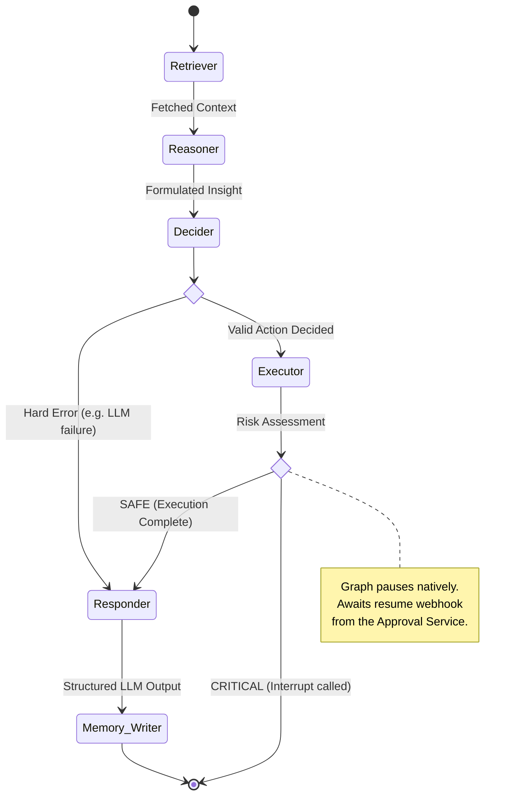

# AKEA Technical Architecture

This document details the exact systems, logic, and infrastructure driving the Autonomous Knowledge Execution Agent (AKEA).

---

## 1. System Topology

AKEA utilizes an event-driven, 7-service microservice mesh. No two services communicate directly unless explicitly routed, ensuring distinct domain boundaries.



---

## 2. Orchestrator: LangGraph Execution Flow

AKEA leverages `langgraph` to guarantee state durability across microservice crashes. The graph executes inside the Orchestrator service.

### Agent Node Sequence



### Design Decisions: Why LangGraph?
1. **Durability:** Standard LangChain chains lose memory if the container dies mid-execution. AKEA compiles the graph using `PostgresSaver(conn_pool)`. If the orchestrator dies, the next request hydrates the exact state from PostgreSQL.
2. **First-Class Interruption:** LangGraph `0.2+` allows the use of `langgraph.types.interrupt()`. This acts as an OS-level breakpoint. The process releases all HTTP connections, freeing the orchestrator to handle other incoming requests while a human is debating an approval.

---

## 3. The Security & HITL Model

AKEA was explicitly designed for high-stakes corporate environments. Security is enforced across three distinct layers.

### 1. Gateway Zero-Trust Authentication
External traffic only enters via the API Gateway. The Gateway verifies an external `X-API-Key`. Before proxying to internal services (e.g., Orchestrator, Action), the Gateway injects a secure `X-Service-Token`. Downstream internal services strictly reject requests lacking this token, preventing SSRF or lateral internal bypassing.

### 2. Hardcoded Action Registry Risk
The LLM does **not** evaluate its own risk. The Action service maintains a hardcoded registry in Python:
- `auto_respond` -> `SAFE`
- `escalate` -> `CRITICAL`
- `request_info` -> `CRITICAL`

When the orchestrator decides to escalate, the registry forces a `CRITICAL` status. 

### 3. Execution Sandbox
All file writes executed by `services/action/handlers/write_handler.py` enforce a strict `Path.resolve().is_relative_to(...)` jail. If an LLM attempts path traversal (`../../etc/passwd`), the Python sandbox triggers an immediate failure.

---

## 4. Database Schema and State Management

### Audit Log (PostgreSQL)
The `audit_log` table tracks every system action. It is protected by database-level security:
```sql
CREATE RULE block_update_audit AS ON UPDATE TO audit_log DO INSTEAD NOTHING;
CREATE RULE block_delete_audit AS ON DELETE TO audit_log DO INSTEAD NOTHING;
```
*Why:* If the `action` or `audit` container is compromised, the attacker cannot tamper with historical records because the PostgreSQL engine itself blocks `UPDATE`/`DELETE`.

### Episodic Memory (pgvector)
```sql
CREATE TABLE episodic_memory (
    id UUID PRIMARY KEY,
    session_id VARCHAR NOT NULL,
    content TEXT NOT NULL,
    embedding vector(384),
    metadata JSONB NOT NULL
);
```
*Why 384 dimensions:* The system utilizes `sentence-transformers/all-MiniLM-L6-v2` via `langchain-huggingface` inside the Knowledge service, which explicitly outputs 384-dimensional dense vectors. 

---

## 5. Known Production Gaps (Technical Limitations)

By analyzing the current source code, the following architectural boundaries exist:

1. **Graph Checkpoint Bloat (Orchestrator)**
   - **The Issue:** When a CRITICAL action triggers `interrupt()`, a checkpoint is saved in PostgreSQL. If the human *never* visits the Approval UI, the Redis TTL times out (15 mins), but the LangGraph checkpointer in Postgres retains the pending state forever. 
   - **The Fix:** Implement a cron job inside the Orchestrator to prune stale `PostgresSaver` checkpoints exceeding the 15-minute window.
   
2. **Filesystem Concurrency (Action Service)**
   - **The Issue:** `write_handler.py` relies on `os.replace()` for atomic writes to `data/workspace/tickets.json`. However, if two concurrent agent sessions attempt to read, mutate, and write back the same JSON file simultaneously, a race condition will cause one mutation to be overwritten.
   - **The Fix:** Introduce a Redis-backed Distributed Lock (`SETNX`) during read-modify-write cycles in the Action service.

3. **In-Memory ThreadPoolExecutor Limits (Orchestrator)**
   - **The Issue:** The orchestrator runs LangGraph chains asynchronously using `asyncio.to_thread`. While this prevents blocking the FastAPI event loop, under extreme load, the default ThreadPool size will throttle throughput.
   - **The Fix:** Transition background execution to a dedicated Celery/RabbitMQ worker pool instead of relying on the web server's native thread pool.
