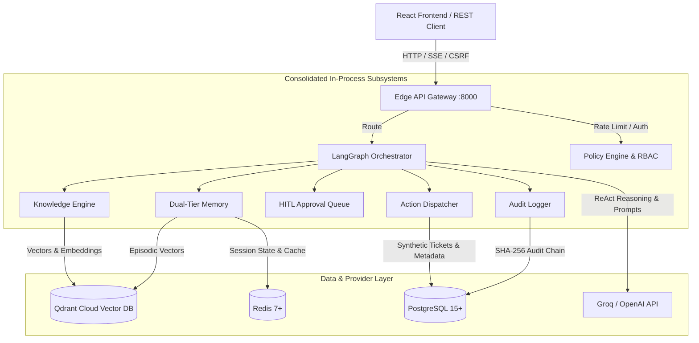
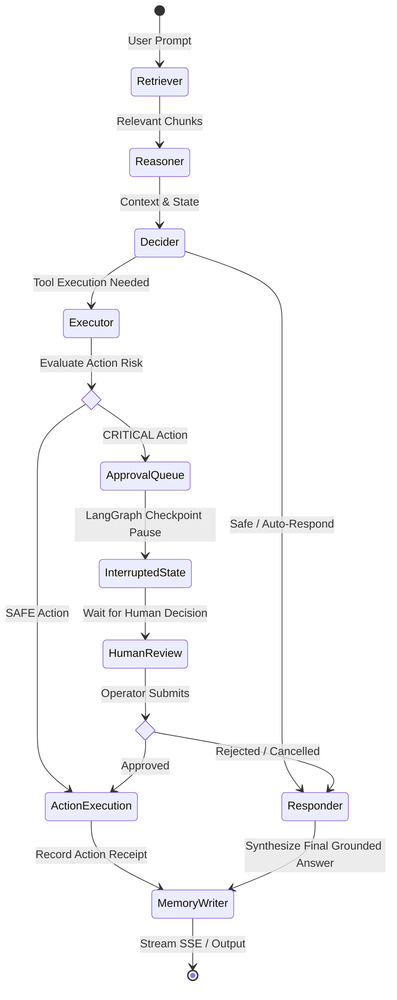

# KRAKEN — Knowledge Retrieval & Autonomous Knowledge Execution Network

> Production-grade autonomous cybersecurity & IT support agent featuring hybrid vector RAG, LangGraph state machine, Human-in-the-Loop (HITL) safety gates, and append-only cryptographic audit logging.

[](https://github.com/JavithNaseem-J/KRAKEN/actions/workflows/ci.yml)
[](https://github.com/JavithNaseem-J/KRAKEN/actions/workflows/deploy.yml)
[](https://www.python.org/)
[](LICENSE)

---

## ⚡ Why KRAKEN? (Problem & Features)

Enterprise IT and security operations cannot risk deploying unconstrained LLMs that hallucinate policies, execute unvetted infrastructure changes, or leak sensitive data. KRAKEN solves this with a deterministic, sandboxed, and verified architecture:

- **Grounded Vector RAG**: Dual-scope retrieval over domain documentation (FAQ, SLA, IAM, compliance) and session-private uploads using Qdrant vector search with cosine distance.
- **Human-in-the-Loop (HITL) Governance**: Automated policy engine intercepts `CRITICAL` risk operations (e.g., ticket escalation, closing, account actions), pausing LangGraph execution until approved via CSRF-protected UI/API with strict four-eyes clearance.
- **Cryptographic Audit Hash-Chain**: Every executed action writes to an append-only PostgreSQL table linked by SHA-256 hashes (`previous_hash` + `record_hash`) for tamper-evident compliance.
- **Deterministic Synthetic Environment (`northstar-v1`)**: 500 tickets and 30 documents running in a sandbox where actions produce verifiable receipts without touching real infrastructure.
- **Private Model Deliberation**: LLM reasoning remains ephemeral inside the agent graph and is strictly excluded from public APIs, SSE streams, audit trails, and browser storage.
- **Multi-Tier Memory & Caching**: Fast exact/semantic response caching in Redis and Qdrant, paired with atomic short-term session history and long-term episodic memory.

---

## 🏗️ Architecture Diagrams

### 1. System Subsystems & Data Flow



### 2. LangGraph Agent Loop & HITL Interrupt Lifecycle



---

## 🛠️ Tech Stack

| Layer | Technologies |
|---|---|
| **Backend & API** | Python 3.12, FastAPI, Uvicorn, Pydantic v2, Structlog |
| **Agent & State Graph** | LangGraph 0.1+, LangChain Core, `AsyncPostgresSaver` |
| **Vector Search & Embeddings** | Qdrant Client, Qdrant Cloud Inference / fastembed, sentence-transformers |
| **Databases & State** | PostgreSQL 15+ (asyncpg & psycopg-pool), Redis 7+ (redis-py / fakeredis) |
| **Frontend** | React 18, TypeScript, Vite, Tailwind CSS, Lucide React, Radix UI |
| **Testing & Tooling** | Pytest, Pytest-Asyncio, Vitest, Playwright, Ruff, Mypy, uv, Docker |

---

## 📊 Verified Metrics & Capabilities

All metrics reflect exact test results and committed configurations in this repository:

| Metric / Parameter | Value in Repository | Source / Verification |
|---|---|---|
| **Backend Unit Test Suite** | **300 passed** | `tests/unit/` (`pytest`) |
| **Production Acceptance Suite** | **8 / 8 passed (100%)** | `scripts/acceptance.py` |
| **Synthetic Dataset (`northstar-v1`)** | **500 tickets, 30 documents, 75 scenarios, 4 SLAs** | `data/synthetic/manifest.json` |
| **Active Knowledge Vectors** | **626 points** indexed | `scripts/reset_synthetic_environment.py verify` |
| **Cryptographic Audit Hashing** | **SHA-256** hash-chain | `src/utils/audit/audit_store.py` |
| **Action Sandboxing** | **`.json` only** within `data/workspace/` | `src/safety/path_validator.py` |
| **Secret Integrity Standard** | **>= 32 characters** (strict rejection of defaults in prod) | `src/utils/config.py` |

---

## 🚀 Quickstart: Setup, Run & Verify

Run the full stack locally via Python or Docker:

```bash
# 1. Clone the repository
git clone https://github.com/JavithNaseem-J/KRAKEN.git
cd KRAKEN

# 2. Setup environment and install dependencies using uv
cp .env.example .env
uv sync --all-extras

# 3. Configure .env with your LLM (Groq), Qdrant, Postgres, and Redis credentials
# (Ensure SYNTHETIC_DATASET_GENERATION=northstar-v1 and QDRANT_COLLECTION_NAME=kraken_knowledge)

# 4. Start the application (serves API & bundled React UI at http://localhost:8000)
python main.py

# --- OR RUN VIA DOCKER ---
# docker build -t kraken:local .
# docker run --rm -p 8000:8000 --env-file .env -e PORT=8000 kraken:local

# 5. Run tests & verification in a separate terminal
pytest tests/unit --basetemp=.pytest_tmp -q
python scripts/reset_synthetic_environment.py verify --expected-generation northstar-v1 --target-generation northstar-v1
python scripts/acceptance.py --base-url http://localhost:8000
```

---

## 🌐 Deployment & Endpoints

- **Live Production URL**: [https://kraken-bdtw.onrender.com](https://kraken-bdtw.onrender.com)
- **Interactive UI**: `/` (React SPA served directly from root)
- **API Health & Readiness**: `GET /health`, `GET /readiness`
- **Prometheus Metrics**: `GET /metrics`
- **Session API**: `POST /v1/session`, `POST /v1/session/persona`, `GET /v1/session/status`
- **Agent Run & Stream**: `POST /v1/run`, `POST /v1/stream` (SSE)
- **HITL Approvals**: `GET /v1/approval/pending`, `POST /v1/approval/decision`

---

## ⚠️ What to Keep in Mind

- **Synthetic Boundaries**: All ticket mutations, IP quarantines, and account operations affect synthetic state only; they never modify real production cloud providers or firewalls.
- **HITL Four-Eyes Policy**: By design, an analyst cannot approve an action they initiated. High-risk operations require an `incident_commander` or `security_lead` persona.
- **Session Isolation**: Uploaded files and session modifications are cryptographically signed to the caller's session and purged upon session reset or generation rollover.

---

## 🔮 Future Work

- **Multi-Modal Evidence Attachments**: Support for image and packet-capture (`.pcap`) vector analysis.
- **Distributed Agent Mesh**: Extension of LangGraph nodes into distributed workers using Redis Streams for high-throughput batch incident triage.
- **Automated Red-Teaming CI Gate**: Direct integration of continuous adversarial prompt-injection fuzzing inside GitHub Actions.
