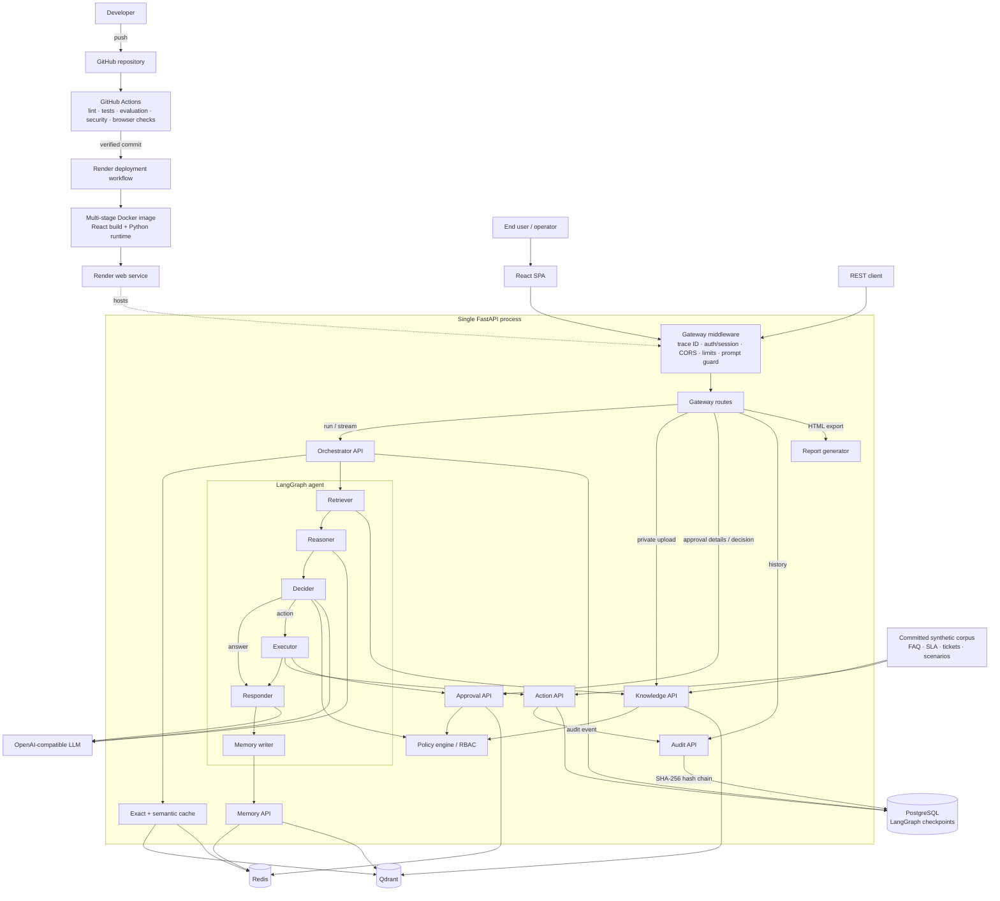
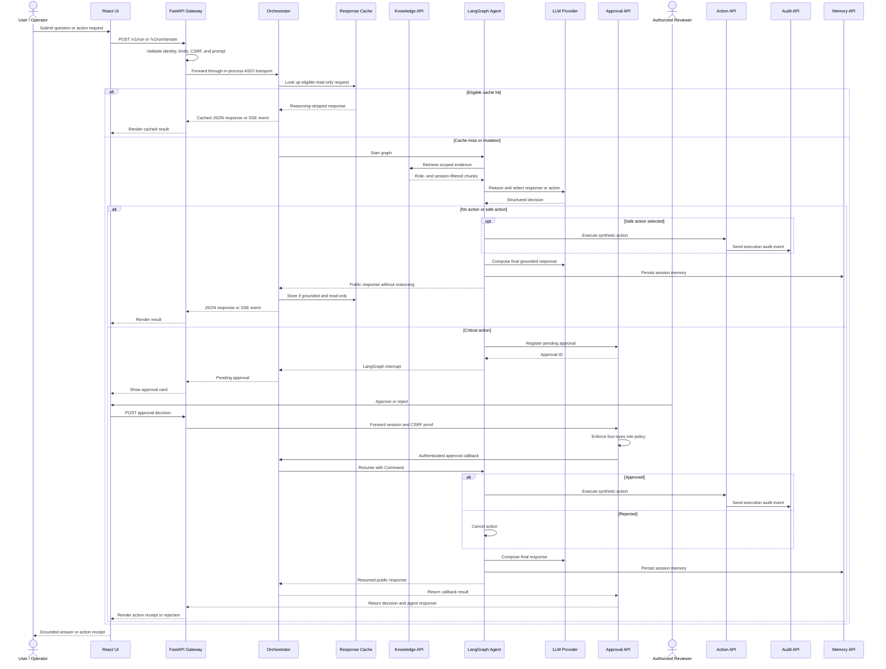

# KRAKEN

KRAKEN is a FastAPI and LangGraph cyber/IT support agent that answers from a synthetic enterprise corpus and gates risky actions behind role-based human approval.

**Demo and deployment:** [kraken-bdtw.onrender.com](https://kraken-bdtw.onrender.com) · configured by [`render.yaml`](render.yaml) and deployed only after successful CI.

## Problem and features

Cybersecurity support agents must use controlled evidence without exposing private reasoning or executing risky changes unchecked. KRAKEN provides:

- hybrid Qdrant retrieval filtered by source, session, role, collection version, and dataset generation;
- a LangGraph pipeline for retrieval, reasoning, action selection, execution, response generation, and memory;
- human approval and four-eyes authorization for registered critical actions;
- signed sessions, CSRF checks, request limits, private expiring uploads, prompt-injection screening, and reasoning-field removal; and
- synthetic ticket, quarantine, account, and file actions plus SHA-256 hash-chained PostgreSQL audit records.

## Architecture

### Full system architecture



### Request and HITL approval sequence



## Tech stack

| Layer | Technologies |
|---|---|
| Backend | Python 3.12, FastAPI, Uvicorn, Pydantic, Structlog |
| Agent and data | LangGraph, LangChain, Qdrant, PostgreSQL, Redis, sentence-transformers |
| Frontend | React 18, TypeScript, Vite, Tailwind CSS |
| Verification and delivery | Pytest, Vitest, Playwright, Ruff, Mypy, Docker, GitHub Actions, Render |

## Verified results

| Check | Result |
|---|---|
| Automated tests | 327 passed: 314 backend unit, 7 backend integration, and 6 frontend |
| Offline evaluator contract | 50 cases; 100.0% source recall, 100.0% required-fact coverage, 100.0% response-contract compliance, 0 prohibited-claim violations, 0 request errors |
| Synthetic corpus | 500 tickets, 30 documents, and 75 capability scenarios |

The offline evaluator is fixture-based contract validation, not a measurement of live model quality. Corpus counts come from [`data/synthetic/manifest.json`](data/synthetic/manifest.json).

## Setup and local usage

Use Python 3.12, Node.js 22, npm, and `uv`. In `.env`, set `HITL_SERVICE_TOKEN` to a unique value of at least 32 characters and set `LLM_API_KEY` for model-backed responses. PostgreSQL, Redis, and Qdrant may remain unset for degraded development mode.

```bash
git clone https://github.com/JavithNaseem-J/KRAKEN.git
cd KRAKEN
cp .env.example .env
# Edit .env as described above.

uv sync --all-extras
cd frontend-react && npm ci && npm run build && cd ..
uv run python main.py

# Basic usage from another terminal:
curl http://localhost:8000/health
```

The compiled UI and API are served at `http://localhost:8000`.

## REST API

Public gateway routes from [`src/api/gateway.py`](src/api/gateway.py):

| Area | Methods and paths | Purpose |
|---|---|---|
| UI | `GET /` | Serve the compiled React app |
| Operations | `GET /health` · `GET /ready` · `GET /version` · `GET /metrics` | Liveness, readiness, build identity, and Prometheus metrics |
| Sessions | `POST /v1/session` · `GET /v1/sessions/{session_id}` · `POST /v1/session/persona` · `POST /v1/session/reset` · `GET /v1/session/status` | Create, inspect, change, reset, and poll a session |
| Agent | `POST /v1/run` · `POST /v1/run/stream` | Run synchronously or stream over SSE |
| Approvals | `GET /approve/{approval_id}/details` · `POST /approve/{approval_id}/decision` | Inspect and decide a session-owned HITL request |
| Knowledge | `POST /v1/knowledge/upload` | Upload a private, expiring document |
| Reports | `POST /v1/report/export` | Export an HTML incident report |
| Audit | `GET /v1/audit/events/{trace_id}` · `GET /v1/audit/history/{trace_id}` | Read trace or session audit history |

## What to keep in mind

- Development can use in-memory fallbacks; `/ready` stays degraded until all production capabilities are available.
- Public sessions and uploads expire after the committed default of 3,600 seconds.
- Audit records are hash-chained, not permanent: the committed retention default is 604,800 seconds and expired rows are deleted.

## Future work

Alembic-managed migrations, automatic Render rollback, measured load/soak thresholds, accessibility automation, and additional browser engines.
