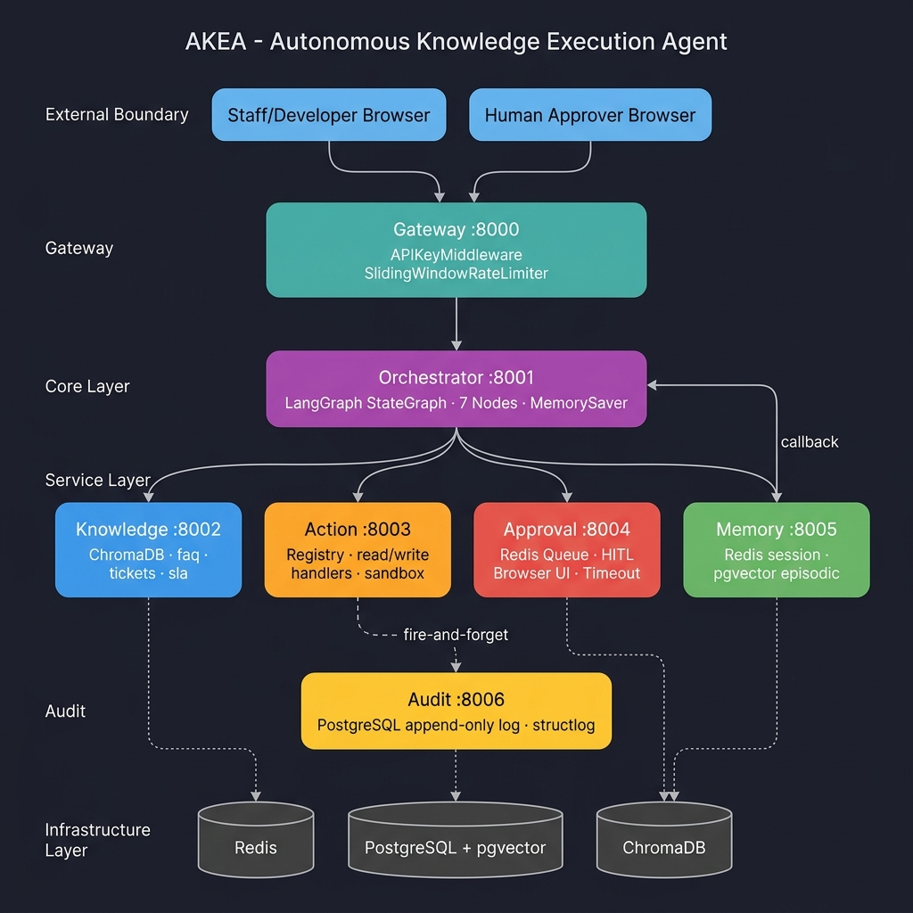
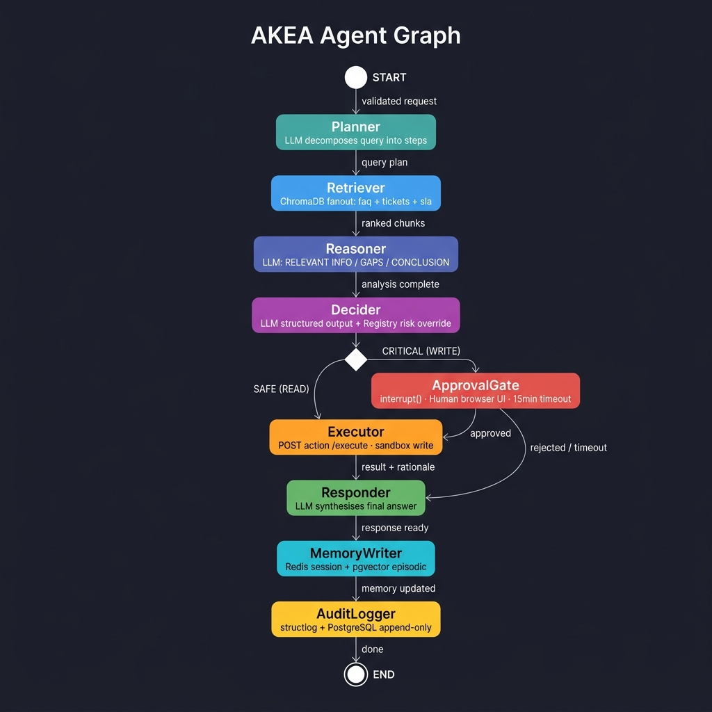
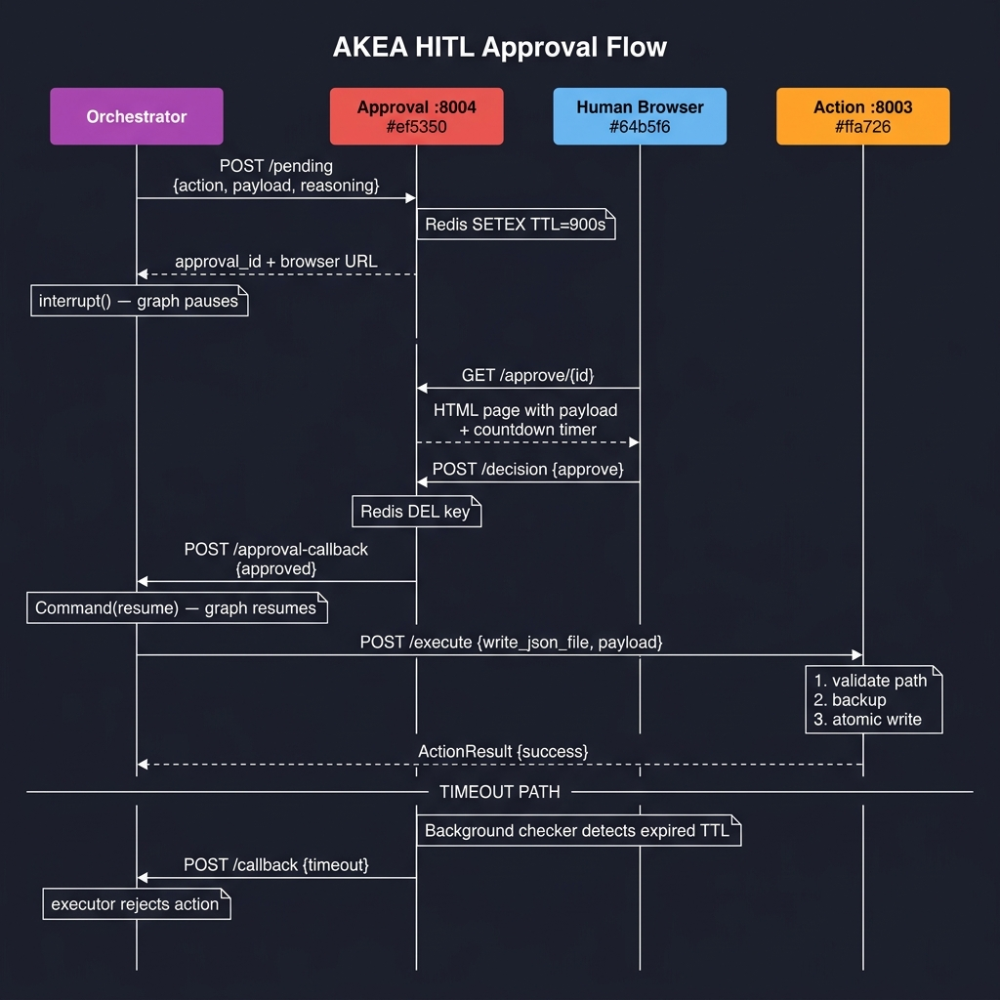
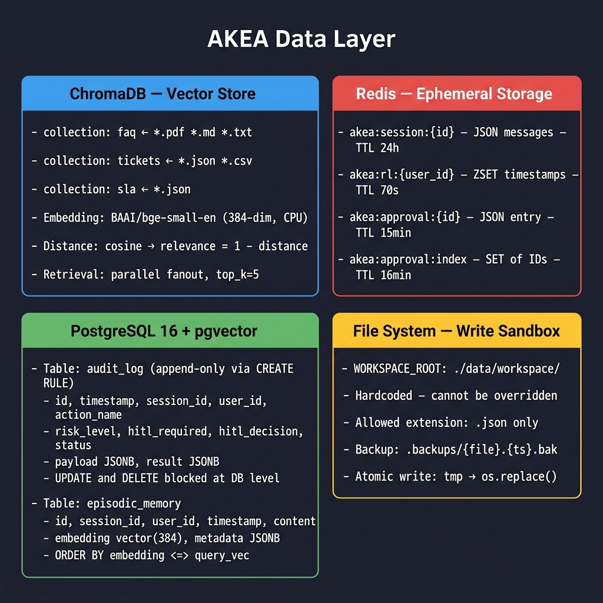

# Autonomous Knowledge Execution Agent (AKEA)

> A production-grade autonomous AI agent that retrieves internal knowledge, reasons over it, and executes actions — with a mandatory Human-in-the-Loop approval gate for all write operations.

---

## Overview

AKEA is a 7-service microservice system built for internal IT helpdesk teams. Given a natural-language request, the agent:

1. **Plans** a sequence of steps to answer it
2. **Retrieves** relevant knowledge from three sources (FAQ, Tickets, SLA rules)
3. **Reasons** over the retrieved chunks using a 120B LLM
4. **Decides** the appropriate action (read a ticket, list tickets, or write a file)
5. **Gates** all write operations behind a human approval step
6. **Executes** the approved action within a strict sandbox
7. **Persists** the interaction to short-term and long-term memory

---

## Architecture

### 1. System Overview



```mermaid
graph TD
    %% Styling
    classDef service fill:#e1f5fe,stroke:#039be5,stroke-width:2px;
    classDef db fill:#efebe9,stroke:#8d6e63,stroke-width:2px;
    classDef client fill:#f1f8e9,stroke:#7cb342,stroke-width:2px;
    classDef hitl fill:#fffde7,stroke:#fbc02d,stroke-width:2px;

    %% Clients & UI
    Client["Client / User API Request"]:::client
    HITL_UI["Human-in-the-Loop Browser UI"]:::hitl

    %% API Gateway
    Gateway["API Gateway (Port 8000)<br/>- Auth Check (X-API-Key)<br/>- Sliding Window Rate Limiting<br/>- Request Routing"]:::service

    %% Microservices
    Orchestrator["Orchestrator Service (Port 8001)<br/>- LangGraph State Machine (7 nodes)<br/>- HITL Pause & Resume Control"]:::service
    Knowledge["Knowledge Service (Port 8002)<br/>- Multi-Source Parallel Query Fan-out<br/>- Local Embedding Generation"]:::service
    Action["Action Service (Port 8003)<br/>- Safe Triage Registry<br/>- Sandbox Executor<br/>- Path/Extension Validation"]:::service
    Approval["Approval Service (Port 8004)<br/>- Pending Action Registry<br/>- Countdown Timer (15m TTL)"]:::service
    Memory["Memory Service (Port 8005)<br/>- Short-Term Session Cache<br/>- Long-Term Epistemic Store"]:::service
    Audit["Audit Service (Port 8006)<br/>- Append-Only Write Log<br/>- Structlog ingestion"]:::service

    %% Databases & Storage
    ChromaDB["ChromaDB Vector Store<br/>Collections: faq, tickets, sla"]:::db
    Redis["Redis Cache & Queue<br/>- Rate Limiting ZSET<br/>- Session JSON List<br/>- Approval Queue"]:::db
    PostgreSQL["PostgreSQL Database<br/>- audit_log (immutable table)<br/>- episodic_memory (pgvector)"]:::db
    Workspace["Local Filesystem<br/>Workspace Sandbox (tickets.json)"]:::db

    %% Flows
    Client -->|1. Submit Query| Gateway
    Gateway -->|2. Route Request| Orchestrator
    Gateway <-->|Rate Limit / Session Cache| Redis
    
    Orchestrator -->|3. Retrieve Knowledge| Knowledge
    Knowledge -->|4. Search Vectors| ChromaDB
    
    Orchestrator -->|5. Triage Decision| Action
    Orchestrator <-->|6. Pause / Resume via interrupt()| Approval
    
    Approval <-->|Register Pending / Check Timeout| Redis
    HITL_UI <-->|7. Approve / Reject| Approval
    
    Action -->|8. Read/Write Tickets| Workspace
    
    Orchestrator -->|9. Summarize & Save| Memory
    Memory -->|Session Storage| Redis
    Memory -->|Episodic Insert| PostgreSQL
    
    Orchestrator -->|10. Write Audit Trail| Audit
    Audit -->|Insert Append-Only| PostgreSQL
```

**Services:**

| Service | Port | Role |
|---|---|---|
| `gateway` | 8000 | Auth (X-API-Key), sliding window rate limit, request proxy |
| `orchestrator` | 8001 | LangGraph 7-node agent, HITL interrupt/resume |
| `knowledge` | 8002 | ChromaDB retrieval, 3-source parallel fanout |
| `action` | 8003 | Registry dispatch, read/write handlers, sandbox safety |
| `approval` | 8004 | Redis approval queue, browser HITL UI, timeout checker |
| `memory` | 8005 | Redis short-term session + pgvector long-term episodic |
| `audit` | 8006 | Append-only PostgreSQL audit log (structlog first, then DB) |

**Infrastructure:**

| Store | Purpose |
|---|---|
| **Redis** | Session memory (TTL=24h), rate limiting (sorted set), approval queue (TTL=15min) |
| **PostgreSQL + pgvector** | Audit log (append-only, CREATE RULE blocks UPDATE/DELETE), episodic memory (vector 384-dim) |
| **ChromaDB** | Vector knowledge store — 3 collections: `faq`, `tickets`, `sla` |

---

### 2. Agent Graph (LangGraph)



**Node details:**

| Node | What it does |
|---|---|
| **Planner** | LLM decomposes the user query into numbered steps |
| **Retriever** | HTTP POST to Knowledge service → ChromaDB fanout across all 3 sources |
| **Reasoner** | LLM analyses chunks → structured output: RELEVANT INFO / GAPS / CONCLUSION |
| **Decider** | LLM proposes action + payload (Pydantic structured output). Risk resolved from REGISTRY — LLM self-assessment is ignored |
| **ApprovalGate** | CRITICAL (WRITE) actions only → `interrupt()` pauses graph → human browser UI → `Command(resume=)` |
| **Executor** | SAFE: direct call to action service. CRITICAL: only after human approval |
| **Responder** | LLM synthesises final answer from reasoning + action result |
| **MemoryWriter** | POST to memory service: Redis session append + pgvector episodic INSERT. Never raises |
| **AuditLogger** | Fire-and-forget POST to audit service (daemon thread). structlog first, then PostgreSQL |

---

### 3. HITL Approval Flow (WRITE Actions Only)



**Step-by-step:**

1. Executor detects CRITICAL risk → POST `/pending` to Approval service
2. Approval service enqueues in Redis with TTL=15min, returns `approval_id` + browser URL
3. `interrupt()` — LangGraph pauses the graph
4. Human opens the browser URL → sees payload, reasoning, and live countdown timer
5. Human clicks **Approve** or **Reject** → POST `/decision`
6. Approval service → POST `/approval-callback` to Orchestrator
7. `Command(resume={"decision": "approve"})` — graph resumes
8. Executor → POST `/execute` → write_handler: validate path → backup → atomic write
9. **Timeout path**: if no human action in 15 min, background checker auto-rejects

---

### 4. Data Layer



**Key design decisions:**

| Store | Key pattern / Schema | Notes |
|---|---|---|
| ChromaDB | `faq`, `tickets`, `sla` collections | BAAI/bge-small-en 384-dim, cosine distance, top_k=5 per source |
| Redis `akea:session:{id}` | JSON list of messages | TTL=24h, atomic append |
| Redis `akea:rl:{user_id}` | ZSET of timestamps | Sliding window rate limiter, TTL=70s |
| Redis `akea:approval:{id}` | JSON approval entry | TTL=15min |
| PostgreSQL `audit_log` | 12-column append-only table | `CREATE RULE` blocks UPDATE and DELETE at DB level |
| PostgreSQL `episodic_memory` | content + vector(384) + metadata JSONB | `ORDER BY embedding <=> $query_vec` cosine search |
| File system | `./data/workspace/` | Hardcoded root, `.json` only, atomic write via `os.replace()` |

---

## Quick Start

### Prerequisites
- Docker Desktop (Windows/Mac) or Docker Engine (Linux)
- Python 3.11+
- Git

### 1. Clone and configure

```bash
git clone https://github.com/your-org/autonomous-knowledge-execution-agent
cd autonomous-knowledge-execution-agent
cp .env.example .env
```

Edit `.env` and set your API key:
```env
LLM_API_KEY=your_actual_groq_or_nvidia_key_here
```

### 2. Install dev dependencies

```bash
make install-dev
```

### 3. Start infrastructure and services

```bash
make up
```

This starts all 7 services + PostgreSQL + Redis + ChromaDB. Wait ~30 seconds for health checks to pass.

### 4. Ingest knowledge base

```bash
make ingest
```

Embeds all documents in `data/knowledge/` into ChromaDB. Run once, or after adding new documents.

### 5. Seed sample data (optional)

```bash
make seed
```

Creates 3 sample tickets in `data/knowledge/tickets/sample_tickets.json`.

### 6. Send your first query

```bash
curl -X POST http://localhost:8000/v1/run \
  -H "Content-Type: application/json" \
  -H "X-API-Key: dev-key-alice" \
  -d '{"message": "What is the SLA for a critical priority ticket?"}'
```

### 7. Run the test suite

```bash
make test
```

### 8. Run the evaluation harness (requires live system)

```bash
make eval
```

---

## Knowledge Base Setup

Add your documents to these directories before running `make ingest`:

| Directory | Content | Format |
|---|---|---|
| `data/knowledge/faq/` | IT support policies, procedures, FAQs | `.pdf`, `.md`, `.txt` |
| `data/knowledge/tickets/` | Historical ticket records | `.json`, `.csv` |
| `data/knowledge/sla/` | SLA rules and escalation definitions | `.json` |

**SLA JSON schema:**
```json
{
  "id": "SLA-001",
  "name": "Critical Priority SLA",
  "priority": "critical",
  "response_time_hours": 1,
  "resolution_time_hours": 4,
  "escalation_path": ["L1 Support", "L2 Support", "Manager"],
  "notes": "Optional description"
}
```

---

## API Reference

### `POST /v1/run`

Submit a natural-language query to the agent.

**Headers:**
```
X-API-Key: your-api-key
Content-Type: application/json
```

**Request:**
```json
{
  "message": "What is the SLA for a critical priority ticket?",
  "session_id": "optional-session-uuid"
}
```

**Response (completed run):**
```json
{
  "session_id": "abc-123",
  "answer": "Critical priority tickets have a 1-hour response time according to SLA-001...\n\nEVIDENCE CITED:\n- SLA-001 response time is 1 hour.",
  "reasoning": "RELEVANT INFORMATION:\n- SLA-001 specifies critical priority response time = 1 hour.",
  "action_taken": "auto_respond",
  "action_result": {
    "status_updated_to": "resolved",
    "ticket_id": null
  },
  "sources": ["faq", "sla"]
}
```

**Response (HITL triggered — CRITICAL action):**
```json
{
  "status": "pending_approval",
  "approval_id": "uuid",
  "session_id": "abc-123",
  "message": "A CRITICAL triage action (escalate) requires human approval. Check the approval service."
}
```

### `POST /v1/approval-callback`

Submit an approval decision after reviewing at the HITL UI.

```json
{
  "approval_id": "uuid-from-pending-response",
  "decision": "approve"
}
```

---

## Security Model

### Write Sandbox

All ticket mutations are restricted to `data/workspace/tickets.json`. This file path is locked and cannot be manipulated by client payloads to overwrite arbitrary system files. Every modification runs under strict validation to prevent path traversal or target file hijacking.

### Human-in-the-Loop

- **SAFE actions** (`auto_respond`): execute automatically to resolve tickets or answer policy questions.
- **CRITICAL actions** (`escalate`, `request_info`, `close`): unconditionally trigger the HITL gate.

The HITL gate cannot be disabled. It is implemented using LangGraph's `interrupt()` function which suspends the graph — the action service is never called until `Command(resume=...)` resumes execution after a human decision.

### Rate Limiting

Sliding window: 10 requests/minute per user (configurable via `GATEWAY_RATE_LIMIT_REQUESTS`).

### Audit Log

Every action is written to the `audit_log` PostgreSQL table. The table has `CREATE RULE` statements that reject `UPDATE` and `DELETE` — the log is append-only at the **database level**, not just the application level.

---

## Environment Variables

| Variable | Default | Description |
|---|---|---|
| `LLM_API_KEY` | — | API key for LLM provider (required) |
| `LLM_BASE_URL` | Groq URL | OpenAI-compatible base URL |
| `LLM_MODEL` | `gpt-oss-120b` | Model name |
| `LLM_TEMPERATURE` | `0.0` | Temperature for deterministic decisions |
| `EMBEDDING_MODEL` | `BAAI/bge-small-en` | Local embedding model |
| `EMBEDDING_DEVICE` | `cpu` | `cpu` or `cuda` |
| `REDIS_URL` | `redis://redis:6379/0` | Redis connection URL |
| `POSTGRES_URL` | see .env.example | PostgreSQL connection URL |
| `CHROMA_PERSIST_DIR` | `./data/chroma` | ChromaDB persistence directory |
| `APPROVAL_TIMEOUT_SECONDS` | `900` | HITL approval timeout (15 minutes) |
| `APPROVAL_PORT` | `8004` | Port printed in terminal approval notice |
| `GATEWAY_API_KEYS` | `dev-key-alice:alice` | API key:user_id pairs (comma-separated) |
| `GATEWAY_RATE_LIMIT_REQUESTS` | `10` | Max requests per window per user |
| `GATEWAY_RATE_LIMIT_WINDOW_SECONDS` | `60` | Rate limit window in seconds |
| `LOG_LEVEL` | `INFO` | Logging level |
| `LOG_FORMAT` | `console` | `console` (dev) or `json` (prod) |

---

## Development

### Running tests

```bash
make test                    # All tests
pytest tests/ -k unit        # Unit tests only
pytest tests/ -k integration # Integration tests only
```

### Linting and type checking

```bash
make lint         # ruff
make format       # ruff --fix
make type-check   # mypy
```

### Viewing logs

```bash
make logs                          # All services
docker compose logs orchestrator   # Single service
```

### Stopping and cleaning up

```bash
make down       # Stop containers (preserves volumes)
make clean      # Stop + delete volumes (resets all data)
```

---

## Evaluation

Run the golden dataset harness against a live system:

```bash
python tests/evals/eval_harness.py \
  --base-url http://localhost:8000 \
  --api-key dev-key-alice \
  --threshold 0.7
```

The harness scores each case across 4 dimensions:
- **Keyword coverage** — expected terms found in the answer
- **Action match** — correct action type selected
- **HITL correctness** — HITL fired when and only when expected
- **Source coverage** — correct knowledge sources cited

Exit code `0` = all cases pass. Exit code `1` = any case below threshold.

---

## Project Structure

```
.
├── docs/
│   └── images/            # Architecture diagrams (PNG)
├── services/
│   ├── gateway/           # Auth, rate limiting, routing
│   ├── orchestrator/      # LangGraph agent (7 nodes)
│   │   └── graph/
│   │       └── nodes/     # planner, retriever, reasoner, decider,
│   │                      # executor, responder, memory_writer
│   ├── knowledge/         # ChromaDB retrieval + /retrieve endpoint
│   │   └── loaders/       # faq_loader, ticket_loader, sla_loader
│   ├── action/            # Read/write handlers + audit integration
│   │   ├── handlers/      # read_handler, write_handler
│   │   └── safety/        # path_validator, backup
│   ├── approval/          # Redis queue + HITL web UI
│   ├── memory/            # Redis short-term + pgvector long-term
│   └── audit/             # Append-only PostgreSQL audit log
├── shared/                # Config, models, exceptions (shared across services)
├── data/
│   ├── knowledge/         # faq/ tickets/ sla/ — source documents
│   └── workspace/         # WRITE SANDBOX — agent can only write here
├── scripts/               # ingest_knowledge.py, seed_data.py, init.sql
├── tests/
│   ├── unit/              # Zero-infra unit tests
│   ├── integration/       # In-memory or mocked infra tests
│   └── evals/             # Golden dataset + eval harness
├── docker-compose.yml
├── Makefile
└── pyproject.toml
```

---

## Tech Stack

| Layer | Technology |
|---|---|
| LLM | `gpt-oss-120b` via Groq / NVIDIA NIM (OpenAI-compatible API) |
| Agent framework | LangGraph 0.2+ (StateGraph + interrupt/resume for HITL) |
| LLM client | LangChain + `langchain-openai` |
| Embeddings | `BAAI/bge-small-en` via `sentence-transformers` (local CPU, 384-dim) |
| Vector store | ChromaDB (persistent, cosine similarity) |
| Web framework | FastAPI + Uvicorn |
| Async HTTP | `httpx` (async client for inter-service calls) |
| Cache / Queue | Redis 7 (session memory + rate limiting + approval queue) |
| Relational DB | PostgreSQL 16 + `pgvector` (episodic memory + audit log) |
| Serialisation | Pydantic v2 |
| Logging | `structlog` (JSON in prod, colored in dev) |
| Containerisation | Docker Compose |
| Testing | `pytest` + `pytest-asyncio` + `fakeredis` |
| Linting | `ruff` + `mypy` |

---

## License

MIT — see [LICENSE](LICENSE).
