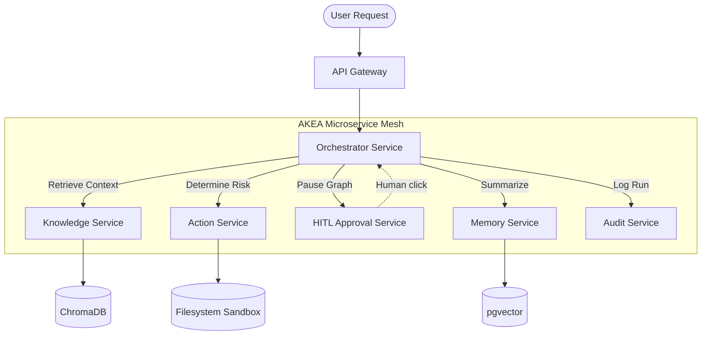

# Autonomous Knowledge Execution Agent (AKEA)

> An autonomous, human-in-the-loop (HITL) AI agent that securely triage IT tickets, fetches knowledge, and executes sandboxed filesystem actions without exposing critical systems to unauthorized LLM writes.

### Key Highlights
* **Zero-Trust Boundary:** All LLM write commands are physically suspended by a state-machine orchestrator until cryptographically verified human approval is received.
* **100% Type-Safe & Linted:** Passes strict `mypy` and `ruff` pipelines with zero warnings.
* **E2E Test Coverage:** 118/118 passing tests verifying idempotency, concurrent locking, and multi-agent routing.
* **Sub-second Vector Search:** Local HuggingFace embeddings (`all-MiniLM-L6-v2`) via ChromaDB ensure rapid knowledge retrieval without external API latency.

---

### Architecture Overview


*(For sequence flows, state schemas, and deeper design decisions, see [ARCHITECTURE.md](ARCHITECTURE.md))*

---

### Tech Stack

* **LangGraph:** Orchestrates multi-step agent reasoning, enabling distributed pausing and resumption across infrastructure replicas via Postgres check-pointing.
* **FastAPI:** Powers the asynchronous, non-blocking 7-microservice mesh, ensuring high-throughput REST communications.
* **ChromaDB & HuggingFace:** Facilitates local, CPU-bound vector storage and similarity search without relying on external API limits.
* **Redis:** Manages sliding-window rate limiters, short-term session conversation history, and ephemeral 15-minute approval queues.
* **PostgreSQL + pgvector:** Acts as an immutable append-only audit trail and long-term episodic memory storage for past LLM interactions.
* **OpenTelemetry:** Injects distributed tracing across all HTTPX service calls for deep multi-agent observability.

---

### How It Works

* **Decomposition & Retrieval:** A user submits an IT request (e.g. "Escalate ticket T-001"). The agent queries an internal ChromaDB for contextual SLA rules and historic ticket data.
* **Reasoning & Decisions:** An LLM cross-references the retrieved context to decide the exact tool and payload to execute. 
* **Hardcoded Risk Registry:** Before execution, the Action service intercepts the decision. If the action modifies state (a "WRITE"), it is permanently classified as `CRITICAL` regardless of the LLM's own risk-assessment.
* **Graph Interruption:** The LangGraph state machine uses `interrupt()` to physically freeze execution. An approval token is generated and passed to the human UI.
* **Safe Execution:** Once the human verifies the exact payload on port `8004`, the Orchestrator resumes, strictly sandboxing execution to the `./data/workspace` directory.

---

### Getting Started

Prerequisites: **Docker Desktop**, **Python 3.12+**, and **Git**.

1. **Configure Environment:**
   ```bash
   cp .env.example .env
   # Add your OpenAI-compatible key (e.g., Groq) to LLM_API_KEY in .env
   # Add your HuggingFace API key to HUGGINGFACE_API_KEY
   ```
2. **Boot Infrastructure:**
   ```bash
   make up
   ```
   *(This starts all 7 microservices + Postgres + Redis + ChromaDB).*
3. **Ingest Knowledge:**
   ```bash
   make ingest
   ```
   *(Embeds internal SLA rules and documentation via `langchain-huggingface` into ChromaDB).*
4. **Interact via UI:**
   Navigate to **http://localhost:8501** to open the Streamlit chat frontend and interact with the agent.

---

### Known Limitations / Future Improvements

* **Single-Process Streamlit Constraints:** The frontend session state is purely in-memory and will not persist across browser refreshes if the container is restarted.
* **Filesystem Sandbox Concurrency:** Writes to `data/workspace/tickets.json` use basic `os.replace()` atomicity, but high-concurrency requests could encounter race conditions without a distributed file lock.
* **Approval Timeout Orphaning:** While the Redis approval queue has a 15-minute TTL, the Orchestrator's LangGraph checkpoint remains paused indefinitely if a human never responds, leading to bloated Postgres checkpoint tables over time.

---

**Full system design → [ARCHITECTURE.md](ARCHITECTURE.md)**
