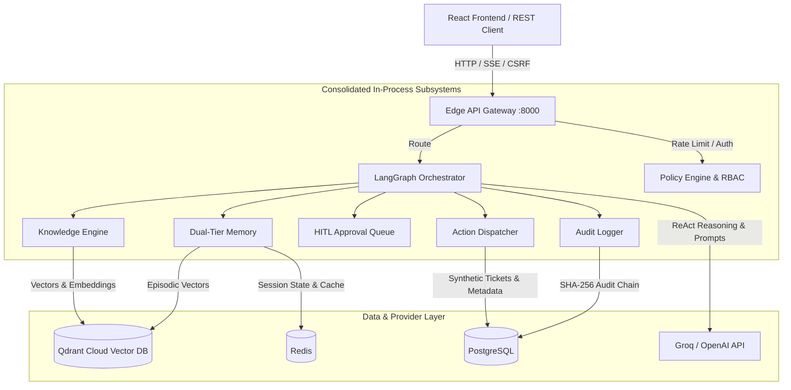
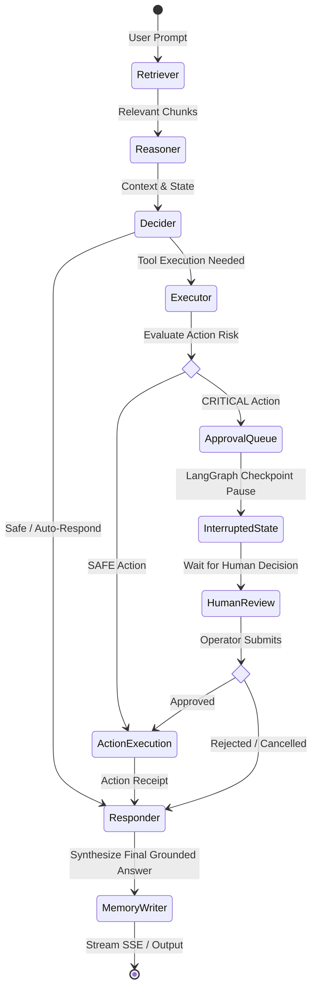

# KRAKEN — Knowledge Retrieval & Autonomous Knowledge Execution Network

> KRAKEN is an AI agent for cybersecurity and IT support. It answers questions using trusted project knowledge, works with support tickets in a safe sandbox, pauses risky actions for human approval, and records actions with a SHA-256 audit chain.

---

## ⚡ Why KRAKEN? (Problem & Features)

Companies cannot safely use an AI agent if it guesses policies, takes risky actions without approval, or exposes sensitive information. KRAKEN reduces those risks by grounding answers in known data, limiting actions to a sandbox, and requiring human approval for high-risk steps.

- **Grounded Vector RAG**: KRAKEN searches trusted documents and user-uploaded session files before answering. It uses Qdrant vector search to find relevant information.
- **Human Approval for Risky Actions**: If an action is marked `CRITICAL`, such as escalating or closing a ticket, KRAKEN pauses and waits for an approved human reviewer.
- **Tamper-Detectable Audit Logs**: KRAKEN stores action records in PostgreSQL. Each record is linked with SHA-256 hashes using `previous_hash` and `entry_hash`, so changes can be detected.
- **Synthetic Test Environment**: The `northstar-v1` dataset includes 500 tickets and 30 documents. Actions run in this sandbox, not against real infrastructure.
- **Private Model Reasoning**: Internal LLM reasoning stays inside the agent workflow. It is not exposed through public APIs, SSE streams, audit logs, or browser storage.
- **Memory and Caching**: KRAKEN uses Redis and Qdrant to cache responses and store short-term and long-term memory.

---

## 🏗️ Architecture Diagrams

### 1. System Subsystems & Data Flow



### 2. LangGraph Agent Loop & HITL Interrupt Lifecycle



---

## 🛠️ Tech Stack

| Layer | Technologies |
|---|---|
| **Backend & API** | Python 3.12, FastAPI, Uvicorn, Pydantic v2, Structlog |
| **Agent & State Graph** | LangGraph 0.1+, LangChain Core, `AsyncPostgresSaver` |
| **Vector Search & Embeddings** | Qdrant Client, Qdrant Cloud Inference, sentence-transformers |
| **Databases & State** | PostgreSQL (asyncpg & psycopg-pool), Redis (redis-py / fakeredis) |
| **Frontend** | React 18, TypeScript, Vite, Tailwind CSS, Lucide React, Radix UI |
| **Testing & Tooling** | Pytest, Pytest-Asyncio, Vitest, Playwright, Ruff, Mypy, uv, Docker |

---

## 📊 Key Results

| Result | Verified Value | Source |
|---|---:|---|
| **Automated tests** | **327 passed**: 314 backend unit, 7 backend integration, 6 frontend | Latest local `pytest` / `vitest` run; suites in `tests/unit`, `tests/integration`, `frontend-react` |
| **Offline evaluator** | **50 cases**; 100.0% source recall, 100.0% required-fact coverage, 100.0% response-contract compliance, 0 prohibited-claim violations, 0 request errors | Latest local offline evaluator run; harness in `tests/evals/eval_harness.py` |
| **Synthetic corpus (`northstar-v1`)** | **500 tickets, 30 documents, 75 capability scenarios** | `data/synthetic/manifest.json` |

The offline evaluator is fixture-based and validates retrieval/response contracts; it does not measure live model quality.

---

## 🚀 Quickstart: Setup, Run & Verify

Prerequisites: Python 3.12, Node.js 22, npm, and uv. Configure `.env` with your LLM, Qdrant, Postgres, and Redis credentials before running the full stack.

```bash
git clone https://github.com/JavithNaseem-J/KRAKEN.git
cd KRAKEN
cp .env.example .env
# Set HITL_SERVICE_TOKEN to a unique value with at least 32 characters.
# Set LLM_API_KEY and any Qdrant/Postgres/Redis settings needed for your environment.
uv sync --all-extras
cd frontend-react
npm ci
npm run build
cd ..
uv run python main.py

# From another terminal:
curl http://localhost:8000/health
```

Open `http://localhost:8000` for the React UI, or call the REST API directly.

---

## 🌐 Deployment & REST API

**Deployment URL**: [https://kraken-bdtw.onrender.com](https://kraken-bdtw.onrender.com)

| Area | Public Gateway Routes | Purpose |
|---|---|---|
| **UI** | `GET /` | Serve the compiled React app |
| **Operations** | `GET /health`, `GET /ready`, `GET /version`, `GET /metrics` | Liveness, readiness, build identity, and Prometheus metrics |
| **Sessions** | `POST /v1/session`, `GET /v1/sessions/{session_id}`, `POST /v1/session/persona`, `POST /v1/session/reset`, `GET /v1/session/status` | Create, inspect, update persona, reset, and check session state |
| **Agent** | `POST /v1/run`, `POST /v1/run/stream` | Run the agent synchronously or stream responses over SSE |
| **Approvals** | `GET /approve/{approval_id}/details`, `POST /approve/{approval_id}/decision` | Review and approve/reject HITL-gated actions |
| **Knowledge** | `POST /v1/knowledge/upload` | Upload session-scoped knowledge files |
| **Reports** | `POST /v1/report/export` | Export an HTML report for a trace/session |
| **Audit** | `GET /v1/audit/events/{trace_id}`, `GET /v1/audit/history/{trace_id}` | Retrieve audit events and audit history |

---

## 🔮 Future Work

These are proposed next steps, not implemented capabilities:

- **Multi-Modal Evidence Attachments**: Support image and packet-capture (`.pcap`) evidence analysis.
- **Distributed Agent Mesh**: Extend LangGraph nodes into distributed workers for batch incident triage.
- **Automated Red-Teaming CI Gate**: Add continuous adversarial prompt-injection fuzzing to CI.
- **Alembic Migrations**: Move schema evolution into versioned database migrations.
- **Automatic Render Rollback**: Roll back a failed production deployment automatically.
- **Load & Soak Testing**: Add measured sustained-traffic thresholds.
- **Accessibility Automation**: Add automated accessibility checks for the React UI.
- **Additional Browser Coverage**: Expand browser coverage beyond the current frontend test path.
