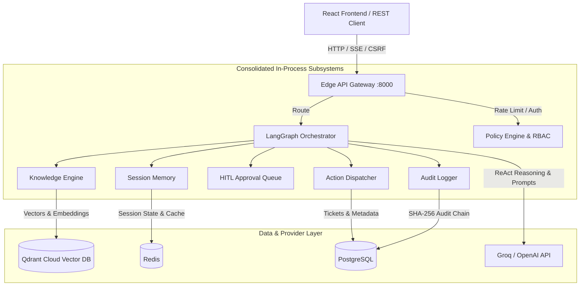
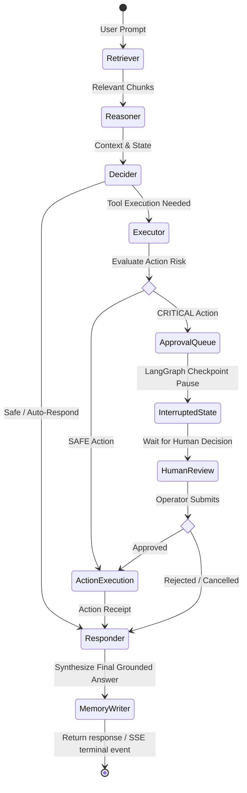

# KRAKEN — Knowledge Retrieval & Autonomous Knowledge Execution Network

> KRAKEN is a production-grade portfolio project for AI-assisted IT and security support. It answers policy questions, manages tickets, pauses critical actions for an approval decision, and records best-effort audit events in a SHA-256 chain using a self-contained Northstar demo dataset.


---

## ⚡ Why KRAKEN? (Problem & Features)

An AI support workflow needs grounded answers and a visible decision point before risky changes. KRAKEN demonstrates those controls through a deployed application with demo roles and application-owned records. It has no measured business impact or external users.

- **Grounded Vector RAG**: KRAKEN searches trusted documents and user-uploaded session files before answering. It uses Qdrant vector search to find relevant information.
- **Approval for Risky Actions**: If an action is marked `CRITICAL`, KRAKEN pauses and requires a verified decision record before execution. Public personas simulate roles; they do not establish two independent humans.
- **Tamper-Detectable Audit Logs**: KRAKEN stores action records in PostgreSQL. Each record is linked with SHA-256 hashes using `previous_hash` and `entry_hash`, so changes can be detected when delivery succeeds. Audit delivery is best-effort.
- **Northstar Demo Dataset**: The `northstar-v1` dataset includes 500 tickets and 30 documents. Actions update KRAKEN's own records; no external corporate systems are connected.
- **Private Model Reasoning**: Internal LLM reasoning stays inside the agent workflow. It is not exposed through public APIs, SSE streams, audit logs, or browser storage.
- **Session Memory and Caching**: Redis stores session history and approval state. Qdrant stores knowledge and semantic cache entries.

---

## 🏗️ Architecture Diagrams

### 1. System Subsystems & Data Flow


```mermaid
graph TD
    Client[React Frontend / REST Client] -->|HTTP / SSE / CSRF| Gateway[Edge API Gateway :8000]

    subgraph Core["Consolidated In-Process Subsystems"]
        Gateway -->|Route| Orchestrator[LangGraph Orchestrator]
        Gateway -->|Rate Limit / Auth| Safety[Policy Engine & RBAC]
        Orchestrator --> Knowledge[Knowledge Engine]
        Orchestrator --> Action[Action Dispatcher]
        Orchestrator --> Approval[HITL Approval Queue]
        Orchestrator --> Memory[Session Memory]
        Orchestrator --> Audit[Audit Logger]
    end

    subgraph Infra["Data & Provider Layer"]
        Knowledge -->|Vectors & Embeddings| Qdrant[(Qdrant Cloud Vector DB)]
        Memory -->|Session State & Cache| Redis[(Redis)]
        Action -->|Tickets & Metadata| Postgres[(PostgreSQL)]
        Audit -->|SHA-256 Audit Chain| Postgres
        Orchestrator -->|ReAct Reasoning & Prompts| LLM[Groq / OpenAI API]
    end
```

### 2. LangGraph Agent Loop & HITL Interrupt Lifecycle


```mermaid
stateDiagram-v2
    [*] --> Retriever: User Prompt
    Retriever --> Reasoner: Relevant Chunks
    Reasoner --> Decider: Context & State

    state Decider <<choice>>
    Decider --> Responder: Safe / Auto-Respond
    Decider --> Executor: Tool Execution Needed

    state RiskCheck <<choice>>
    Executor --> RiskCheck: Evaluate Action Risk

    RiskCheck --> ActionExecution: SAFE Action
    RiskCheck --> ApprovalQueue: CRITICAL Action

    ApprovalQueue --> InterruptedState: LangGraph Checkpoint Pause
    InterruptedState --> HumanReview: Wait for Human Decision

    state Decision <<choice>>
    HumanReview --> Decision: Operator Submits
    Decision --> ActionExecution: Approved
    Decision --> Responder: Rejected / Cancelled

    ActionExecution --> Responder: Action Receipt
    Responder --> MemoryWriter: Synthesize Final Grounded Answer
    MemoryWriter --> [*]: Return response / SSE terminal event
```

---

## 🛠️ Tech Stack

| Layer | Technologies |
|---|---|
| **Backend & API** | Python 3.12, FastAPI, Uvicorn, Pydantic v2, Structlog |
| **Agent & State Graph** | LangGraph 0.1+, LangChain Core, `AsyncPostgresSaver` |
| **Vector Search & Embeddings** | Qdrant Client, Qdrant Cloud Inference, sentence-transformers |
| **Databases & State** | PostgreSQL (asyncpg & psycopg-pool), Redis (redis-py / fakeredis) |
| **Frontend** | React 18, TypeScript, Vite, Tailwind CSS, Lucide React, Radix UI |
| **Testing & Tooling** | Pytest, Pytest-Asyncio, Vitest, Playwright, Ruff, Mypy, uv, Docker |

---

## 📊 Key Results

| Result | Verified Value | Source |
|---|---:|---|
| **Automated tests** | **340 Python unit/eval, 7 backend integration, 9 frontend passed** | Local `pytest` and `vitest` runs on this change; suites in `tests/unit`, `tests/evals`, `tests/integration`, `frontend-react` |
| **Offline evaluator** | **50 cases**; 100.0% source recall, 100.0% required-fact coverage, 100.0% response-contract compliance, 0 prohibited-claim violations, 0 request errors | Latest local offline evaluator run; harness in `tests/evals/eval_harness.py` |
| **Northstar demo corpus (`northstar-v1`)** | **500 tickets, 30 documents, 75 capability scenarios** | `data/synthetic/manifest.json` |

The offline evaluator is fixture-based and checks the evaluator contract. It does not measure live model quality. A full 50-case run on an isolated local staging target returned 48 passes, 100% source recall, 77.8% required-fact coverage against an 80% threshold, and no request errors. The result fails the live quality gate. Repeated SSE runs found terminal responses but no visible answer deltas for substantive questions. The [portfolio guide](docs/portfolio.md) gives the target setup, sample counts, and limits.

---

## 🚀 Quickstart: Setup, Run & Verify

Prerequisites: Python 3.12, Node.js 22, npm, and uv. Configure `.env` with your LLM, Qdrant, Postgres, and Redis credentials before running the full stack.

```bash
git clone https://github.com/JavithNaseem-J/KRAKEN.git
cd KRAKEN
cp .env.example .env
# Set HITL_SERVICE_TOKEN to a unique value with at least 32 characters.
# Set LLM_API_KEY and any Qdrant/Postgres/Redis settings needed for your environment.
uv sync --all-extras
cd frontend-react
npm ci
npm run build
cd ..
uv run python main.py

# From another terminal:
curl http://localhost:8000/health
```

Open `http://localhost:8000` for the React UI, or call the REST API directly.

---

## 🌐 Deployment & REST API

**Deployment URL**: [https://kraken-bdtw.onrender.com](https://kraken-bdtw.onrender.com)

| Area | Public Gateway Routes | Purpose |
|---|---|---|
| **UI** | `GET /` | Serve the compiled React app |
| **Operations** | `GET /health`, `GET /ready`, `GET /version`, `GET /metrics` | Liveness, readiness, build identity, and Prometheus metrics |
| **Sessions** | `POST /v1/session`, `GET /v1/sessions/{session_id}`, `POST /v1/session/persona`, `POST /v1/session/reset`, `GET /v1/session/status` | Create, inspect, update persona, reset, and check session state |
| **Agent** | `POST /v1/run`, `POST /v1/run/stream` | Run the agent synchronously or receive SSE events; substantive answers currently finish without visible deltas in the measured path |
| **Approvals** | `GET /approve/{approval_id}/details`, `POST /approve/{approval_id}/decision` | Review and approve/reject HITL-gated actions |
| **Knowledge** | `POST /v1/knowledge/upload` | Upload session-scoped knowledge files |
| **Reports** | `POST /v1/report/export` | Export an HTML report for a trace/session |
| **Audit** | `GET /v1/audit/events/{trace_id}`, `GET /v1/audit/history/{trace_id}` | Retrieve audit events and audit history |

---

## 🔮 Future Work

The next engineering step is to have the normal read-only answer path emit visible responder deltas, then measure first-answer latency and early disconnects on a target with hosted-service parity. The two required-fact misses in the 50-case live run also need repeat evaluation after that change. A durable audit outbox would be needed before claiming guaranteed audit delivery.
