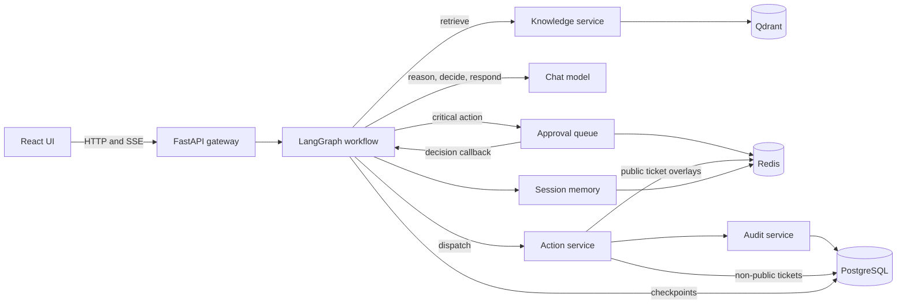

# KRAKEN

A portfolio project demonstrating production-grade patterns for AI-assisted IT and security support. It grounds answers in a controlled knowledge base and requires recorded approval before critical actions change its Northstar demo records.

Python 3.12 · FastAPI · LangGraph · Qdrant · Redis · PostgreSQL · React · TypeScript · Docker

KRAKEN answers policy and ticket questions, creates support tickets, and stages higher risk requests such as IP quarantine for review. Northstar is a self-contained demo dataset: public personas are switchable demo roles, and containment and account unlock actions update application-owned records rather than external security systems. The action service checks approval evidence again before dispatch, even after the agent resumes.

**Live demo:** [kraken-bdtw.onrender.com](https://kraken-bdtw.onrender.com). The site served the verified `HOLDOUT-001` evaluation on 2026-10-03. A three-flow [interview walkthrough](docs/portfolio.md#interview-walkthrough) covers a cited answer, a ticket, and an approved or denied critical action.

## Evidence

| Evidence | Observed result | Scope |
|---|---:|---|
| Public-site RAGAS check | `HOLDOUT-001` passed; faithfulness **1.0**, context recall **1.0** | One cached answer at app commit `835987f`; no fresh-generation or full-suite claim |
| Full live local staging evaluation | 48/50 cases passed; 77.8% required-fact coverage against an 80% gate | **Failed** quality gate on older commit `5cd5d06`; isolated target, not hosted latency |
| Same run: expected source presence | 100% | Checks for source IDs in serialized responses; does not prove every answer is faithful |
| Offline evaluator fixture | 50/50 cases passed | Tests scoring and response contracts; answers are built from expected facts |
| Substantive SSE samples | 0/10 emitted visible answer deltas; 10/10 ended with a terminal event | Older local staging run; first-visible-answer latency remains unmeasured |

The **1.0 RAGAS scores are not 100% AI accuracy**. This one cached case expected document `DOC-001` and three phrases: `GlobalProtect`, `vpn.northstar.example`, and `MFA`. They were present, and the RAGAS judge rated the answer as supported by the retrieved text. This does not estimate success across new questions, fresh generations, or agent actions.

The [portfolio guide](docs/portfolio.md#verification-and-evidence) records the evaluation setup and limits. The RAGAS result is one public-site cache hit; the full live staging and SSE numbers are from an older revision. Reports are local and ignored by Git. The committed [corpus manifest](data/synthetic/manifest.json) defines 500 demo tickets, 30 documents, and 75 capability scenarios. The evaluator exercises 50 cases from the [suite definition](data/synthetic/evaluation_suite.json); it is not an external benchmark.

## Architecture


```mermaid
flowchart LR
    UI[React UI] -->|HTTP and SSE| Gateway[FastAPI gateway]
    Gateway --> Graph[LangGraph workflow]
    Graph -->|retrieve| Knowledge[Knowledge service]
    Knowledge --> Qdrant[(Qdrant)]
    Graph -->|reason, decide, respond| Model[Chat model]
    Graph -->|critical action| Approval[Approval queue]
    Approval --> Redis[(Redis)]
    Approval -->|decision callback| Graph
    Graph -->|dispatch| Action[Action service]
    Action -->|public ticket overlays| Redis
    Action --> Audit[Audit service]
    Audit --> Postgres[(PostgreSQL)]
    Action -->|non-public tickets| Postgres
    Graph -->|checkpoints| Postgres
    Graph --> Memory[Session memory]
    Memory --> Redis
```

- The gateway creates signed public sessions, owns persona state, checks CSRF and rate limits, then routes requests to in-process service apps ([gateway](src/api/gateway.py), [HTTP routing](src/utils/http_client.py)).
- The graph runs retrieval → reasoning → decision → optional execution → response → memory write. It uses PostgreSQL checkpoints when available and an in-memory saver otherwise ([graph](src/agent/agent.py), [orchestrator](src/api/orchestrator.py)).
- Knowledge ingestion splits the Northstar FAQ, SLA, and ticket corpus into Qdrant points. Retrieval filters by role, session scope, dataset generation, and collection version. It ranks keyword matches **within** vector candidates with reciprocal-rank fusion and heuristic boosts; there is no independent lexical index ([retriever](src/utils/knowledge/retriever.py)).
- The decider selects from a fixed action registry; policy code assigns risk and allowed roles. Critical actions pause at a LangGraph interrupt. The action service verifies a matching, unexpired Redis decision and claims execution once before calling a handler ([policy](src/safety/policy_engine.py), [action](src/api/action.py)).

### Engineering choices

**Approval at dispatch.** A callback alone cannot authorize a critical write. The action service binds approval to the action, payload, session, actor, and dataset generation. This protects the mutation boundary, but critical writes need the shared Redis decision store. If a mutation completes and result storage fails, an automatic repeat is refused until the target state is checked.

**One deployed process, explicit service boundaries.** The gateway enters six FastAPI sub-app lifespans and routes internal HTTP calls to them. One Docker image is practical for a portfolio deployment, while all subsystems share process availability and resources.

**Versioned demo records.** The corpus has a fixed seed, checksums, generation tags, and role metadata. Public ticket changes are session overlays in Redis, with an in-memory fallback. This keeps demonstrations repeatable and private uploads and ticket changes scoped. Performance on real company documents and external system integration remain unmeasured.

The code also includes model fallback and a circuit breaker, bounded retries for selected internal calls, trace IDs, redacted structured logging, source isolation tests, and a hash-linked PostgreSQL audit log. Audit delivery is best effort; a missing write cannot be detected by the chain alone.

## Run locally

Prerequisites: Python 3.12, Node.js 22, npm, and [uv](https://docs.astral.sh/uv/). Copy the template, then configure a unique `HITL_SERVICE_TOKEN` of at least 32 characters and the `LLM_API_KEY`, Qdrant, Redis, and PostgreSQL values required for the workflows you intend to use. Production settings require the backing providers; empty local settings can start degraded services. See [.env.example](.env.example) and [settings](src/utils/config.py).

```bash
cp .env.example .env
uv sync --all-extras
cd frontend-react && npm ci && npm run build && cd ..
uv run python main.py
```

Open `http://localhost:8000`; `/health` checks gateway liveness and `/ready` checks provider capabilities. The commands above were verified against manifests and entry points, not executed for this README change.

## Verification

GitHub Actions defines lint, typecheck, unit/integration, offline evaluation, browser contract, container health, and security scan jobs. The [2026-10-03 CI run](https://github.com/JavithNaseem-J/KRAKEN/actions/runs/37100956499) passed every job for commit `d0cf774`. The browser contract suite uses an API fixture; it is distinct from a live model evaluation. For checks after setup:

```bash
uv run python -m pytest tests/unit tests/evals -q
uv run python -m pytest tests/integration -m integration -q
uv run python tests/evals/eval_harness.py --mode offline
```

For a live RAGAS check, set `BASE_URL` to the target site and `DEPLOYED_SHA` to its `/version` commit SHA, then run:

```bash
uv run python tests/evals/eval_harness.py --mode live --base-url "$BASE_URL" --expected-sha "$DEPLOYED_SHA" --case HOLDOUT-001 --ragas
```

RAGAS sends the question, answer, retrieved text, and reference facts to the configured LLM provider. Frontend commands live in [package.json](frontend-react/package.json): `npm run typecheck`, `npm test`, and `npm run test:e2e:critical`. The [portfolio guide](docs/portfolio.md#verification-and-evidence) explains the live evaluator’s revision and corpus requirements.

## Limits

- This is a portfolio demo with no external users or measured business impact.
- The last documented full live quality gate failed required-fact coverage. The one-case RAGAS result used a cache hit; no current-revision full-suite live quality result exists. Offline fixture scores do not measure model accuracy.
- Public persona switching demonstrates policy routing, not independent human identity. Firewall and identity actions produce demo receipts rather than changes to those systems.
- Visible answer streaming did not occur in the measured substantive SSE samples. Audit delivery is asynchronous and best effort.
- Knowledge collection settings differ: the Python default is `v4`, while `.env.example` and [Render configuration](render.yaml) set `v3`. Evaluation and deployment claims must name the active version.

## Next evaluation

Reconcile the knowledge version, run the full suite on staging with cache behavior controlled, measure agent action and approval outcomes separately, and fix visible response deltas before measuring streaming latency.

## Licensed

Licensed under [MIT](LICENSE).
