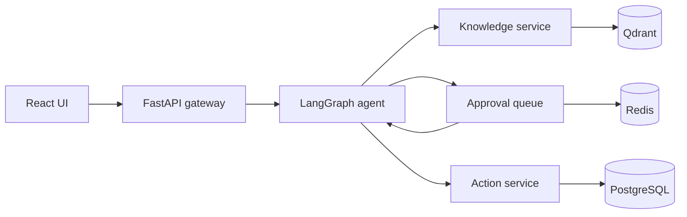

# KRAKEN

KRAKEN is a portfolio project that demonstrates how an AI support agent can answer questions from a controlled knowledge base, create tickets, and require human approval before a critical action. It uses Northstar demo records and roles. Firewall and account actions change application-owned demo state; they do not operate real security systems.

**Click Here:** [Live](https://kraken-bdtw.onrender.com)

**Stack:** Python 3.12, FastAPI, LangGraph, Qdrant, Redis, PostgreSQL, React, TypeScript, and Docker.

## What it demonstrates

- **Grounded answers:** retrieve FAQ, SLA, and ticket records from Qdrant, filter them by role and session, and cite the sources used in the response.
- **Agent workflow:** LangGraph separates retrieval, reasoning, action selection, execution, response, and memory updates.
- **Approval at the action boundary:** critical actions pause for a decision. The action service checks the stored decision again before changing demo state.
- **Application controls:** signed public sessions, rate limits, input checks, trace IDs, and a PostgreSQL audit log.
- **Deployment:** one Docker image serves the API and React UI. GitHub Actions builds and checks the image before triggering Render and checking the deployed commit.


```mermaid
flowchart LR
    UI[React UI] --> Gateway[FastAPI gateway]
    Gateway --> Agent[LangGraph agent]
    Agent --> Knowledge[Knowledge service]
    Knowledge --> Qdrant[(Qdrant)]
    Agent --> Approval[Approval queue]
    Approval --> Redis[(Redis)]
    Approval --> Agent
    Agent --> Actions[Action service]
    Actions --> Postgres[(PostgreSQL)]
```

The gateway hosts the service apps in one process. Qdrant holds the indexed Northstar FAQ, SLA, and ticket records. Redis supports approval decisions and public session state. PostgreSQL stores checkpoints, audit entries, and non-public tickets. See the [agent graph](src/agent/agent.py), [retriever](src/utils/knowledge/retriever.py), [approval queue](src/utils/approval/queue.py), and [action service](src/api/action.py).

## Deployment and data

The public repository tracks the code, dependency lockfiles, Dockerfile, Render blueprint, deployment workflow, and this README. Source documents, generated data, ingestion scripts, tests, evaluation records, and local configuration stay on the project owner's computer and are excluded from Git. The production image does not contain those files. Re-indexing is run from the local checkout against Qdrant when needed; the deployed app reads the existing index.

The checked-in [Render blueprint](render.yaml) and [settings defaults](src/utils/config.py) specify knowledge version `v4` and generation `northstar-v1`. On 2026-10-04, a local Qdrant index was rebuilt with 626 v4 records: 121 FAQ chunks, 500 tickets, and 5 SLA entries. Independent counts found no v2 or v3 records in that index, and an SLA retrieval query succeeded.

The [deployment run for commit `a537012`](https://github.com/JavithNaseem-J/KRAKEN/actions/runs/37196594836) passed its build and live readiness checks. The live `/version` endpoint still reported **v2** on 2026-10-04, while `/health` and `/ready` reported healthy. This means the hosted service's effective configuration or Qdrant target does not match the locally rebuilt v4 index. **The live app has not been verified against v4.** Align the Render environment and Qdrant target before claiming that it uses the fresh index.

## Run locally

Install Python 3.12, Node.js 22, npm, and [uv](https://docs.astral.sh/uv/). Configure your own `.env` with a unique `HITL_SERVICE_TOKEN` of at least 32 characters and the provider URLs and keys needed for the workflows you want to run. The [settings](src/utils/config.py) and [Render blueprint](render.yaml) list the variables. Full workflows need a populated Qdrant collection and working Redis and PostgreSQL services.

```bash
uv sync --frozen
cd frontend-react
npm ci
npm run build
cd ..
uv run uvicorn src.api.gateway:app --host 127.0.0.1 --port 8000
```

Open `http://localhost:8000`. `/health` checks process liveness, `/ready` checks configured capabilities, and `/version` shows the effective build and knowledge version. A fresh clone does not include the private local corpus or ingestion tools.

## Evaluation and limits

The latest recorded isolated answer evaluation passed **21 of 40 scored cases** and failed its quality gate. Earlier RAGAS faithfulness and context-recall scores of 1.0 came from one cached question, so they do not measure overall agent accuracy. These are historical observations, not results for the fresh v4 index. Development tests and evaluation materials are kept locally and are not reproducible from this deployment-only repository.

This project showcases engineering choices; it has no external users or measured business impact. Public personas demonstrate role-based behavior, not verified human identity. Approval and audit controls are implemented, but external security integrations, real-world document quality, and end-to-end production reliability have not been established.
