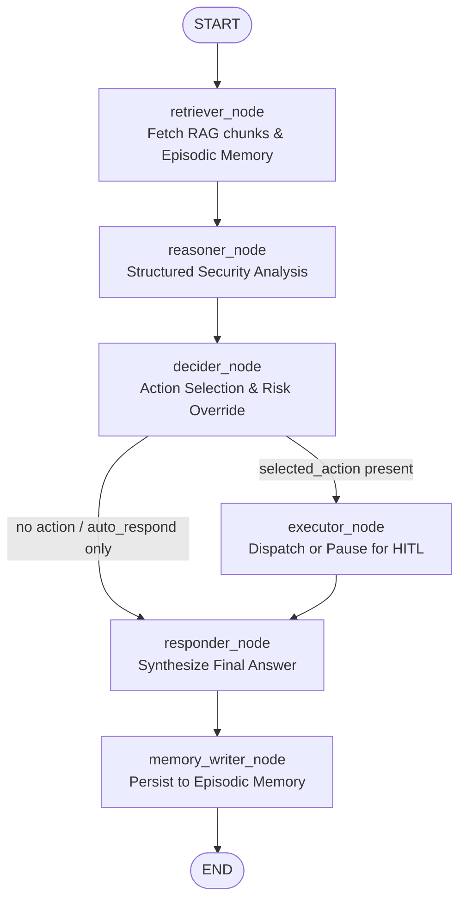

# KRAKEN Agent Reasoning Pipeline

This document describes the internal LangGraph state machine, node contracts, routing logic, and prompt management workflows for the KRAKEN autonomous AI agent.

---

## 1. Pipeline Topology & Data Flow

The KRAKEN agent uses a directed state graph built with LangGraph (`src/agent/agent.py`). Every incoming request transitions deterministically through the following node sequence:



---

## 2. Node Contract Matrix

Each node operates on the shared `GraphState` TypedDict defined in `src/agent/state.py`. The table below defines the exact contract for each node in the pipeline:

| Node | Input State Keys | Output State Keys | LLM Call? | Prompt / Engine File |
|---|---|---|---|---|
| **`retriever`** | `user_message`, `session_id`, `user_id` | `retrieved_chunks`, `error` | No | `src/utils/knowledge/retriever.py` |
| **`reasoner`** | `user_message`, `retrieved_chunks`, `session_id` | `reasoning`, `insufficient_knowledge`, `error` | Yes | `src/prompts/reasoner_v1.py` |
| **`decider`** | `user_message`, `reasoning`, `session_id` | `selected_action`, `selected_actions`, `action_payload`, `risk_level`, `evidence`, `error` | Yes (Structured JSON) | `src/prompts/decider_v1.py` & `src/safety/policy_engine.py` |
| **`executor`** | `selected_actions`, `selected_action`, `action_payload`, `risk_level`, `reasoning`, `session_id`, `user_id` | `action_result`, `approval_status`, `approval_id`, `error` | No (LangGraph `interrupt()` on CRITICAL) | `src/agent/nodes/executor.py` |
| **`responder`** | `user_message`, `reasoning`, `selected_action`, `action_result`, `approval_status`, `evidence`, `error`, `session_id` | `final_answer`, `action_explanation`, `messages` | Yes | `src/prompts/responder_v1.py` |
| **`memory_writer`** | `session_id`, `user_id`, `user_message`, `final_answer`, `selected_action`, `approval_status` | `memory_written`, `error` | No | `src/utils/memory/long_term.py` |

---

## 3. Dynamic Routing & Risk Classification

1. **Deterministic Safety Policy Gate**:
   - Status queries (e.g. *"What is the status of ticket TCK-1001?"*) and operational requests without an explicit ticket ID are automatically overridden to `auto_respond` by `should_override_to_auto_respond()` in `src/safety/policy_engine.py`.
2. **Registry-Enforced Risk Override**:
   - Risk levels (`SAFE` vs `CRITICAL`) are defined strictly in `src/utils/registry.py`. The LLM's suggested risk is never trusted directly.
3. **Execution Branching**:
   - If `selected_action` is present, the graph transitions to `executor`.
   - `SAFE` actions execute immediately and concurrently via `asyncio.gather`.
   - `CRITICAL` actions register with the approval queue and trigger LangGraph `interrupt()`, pausing the graph state in PostgreSQL until human authorization is submitted.

---

## 4. Prompt Management Workflow

All system prompts and prompt templates are strictly isolated in `src/prompts/` and managed via `src/prompts/registry.py`.

### How to Modify or Upgrade a Prompt

1. **Create a new versioned file**:
   Copy the active prompt file to a new version (e.g. `src/prompts/decider_v1.py` → `src/prompts/decider_v2.py`).
2. **Edit the prompt content**:
   Update the system prompt rules or markdown layout in the new file.
3. **Update the Manifest Registry**:
   In `src/prompts/registry.py`, point the node to the new module:
   ```python
   ACTIVE_VERSIONS["decider"] = "src.prompts.decider_v2"
   ```
4. **Run Unit Tests**:
   Execute `pytest tests/unit/agent/test_prompt_registry.py` to verify prompt formatting and template variable presence.
5. **Deploy & Restart**:
   Deploy the code and restart the application service.

### How to Rollback a Prompt

To revert an updated prompt, simply change the `ACTIVE_VERSIONS` entry back to the previous version (e.g. `"src.prompts.decider_v1"`) and restart the service.

---

## 5. How to Add a New Pipeline Node

1. Create the async node function in `src/agent/nodes/<node_name>.py` adhering to `GraphState` inputs and dict outputs.
2. Export the function in `src/agent/nodes/__init__.py`.
3. In `src/agent/agent.py`:
   - Add `builder.add_node("<node_name>", <node_func>)`
   - Wire incoming and outgoing edges using `builder.add_edge()` or `builder.add_conditional_edges()`.
4. Add corresponding unit tests in `tests/unit/agent/test_<node_name>.py`.
