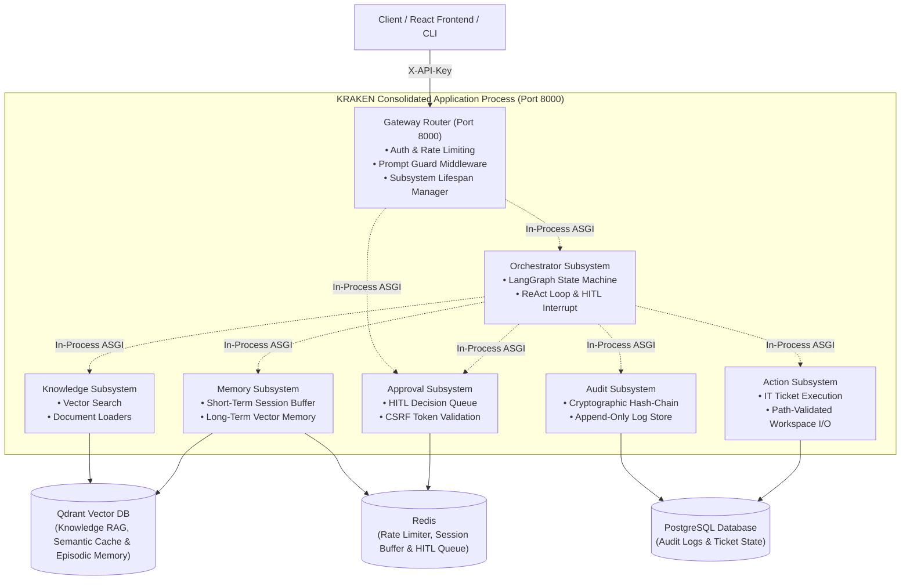
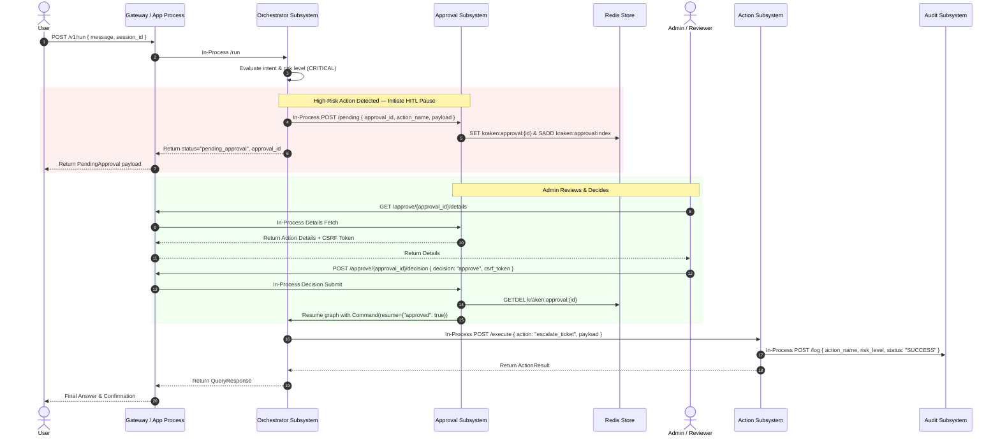

# KRAKEN Consolidated Architecture

KRAKEN (Knowledge Retrieval & Autonomous Knowledge Execution Network) is a production-grade autonomous AI system designed for automated IT service desk operations, knowledge retrieval, and human-in-the-loop (HITL) action execution.

For details on the internal LangGraph reasoning state machine, node contracts, and prompt versioning, see [Agent Pipeline](agent-pipeline.md).

---

## 1. System Topology Diagram

The following diagram illustrates the consolidated architecture layout, in-process routing, and backing storage components.

---

## 2. Human-in-the-Loop (HITL) Approval Sequence Diagram

High-risk actions (such as ticket escalation or destructive file operations) trigger a HITL pause. The execution graph yields state and awaits human review via the Gateway approval endpoints.

---

## 3. Subsystem Responsibilities

| Subsystem | Port / Route | Primary Responsibility | Backing Store |
| :--- | :--- | :--- | :--- |
| **Gateway** | 8000 | Reverse proxy, API key validation, prompt guard security filter, rate limiting, sub-app lifespan orchestration. | In-memory sliding window / Redis |
| **Orchestrator** | In-Process | LangGraph agent execution loop, tool routing, checkpoint persistence, HITL interrupt. | Qdrant & PostgreSQL (checkpoints) |
| **Knowledge** | In-Process | SLA rules and operational doc loading, embedding generation, Qdrant vector retrieval. | Qdrant Vector Cloud |
| **Action** | In-Process | Risk-classified IT action handlers (tickets, workspace file I/O). | PostgreSQL (`tickets`) |
| **Approval** | In-Process & `:8000/approve/*` | Human-in-the-Loop (HITL) pause handling, CSRF-protected web review and API proxy endpoints. | Redis |
| **Memory** | In-Process | Short-term message history buffer and long-term episodic memory storage. | Redis & Qdrant (`kraken_episodic_memory`) |
| **Audit** | In-Process | Cryptographically chained, append-only security audit log. | PostgreSQL (`audit_log`) |
