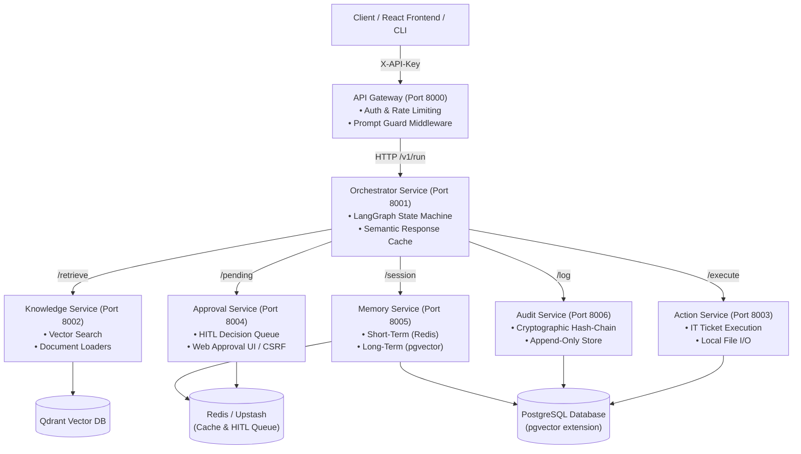
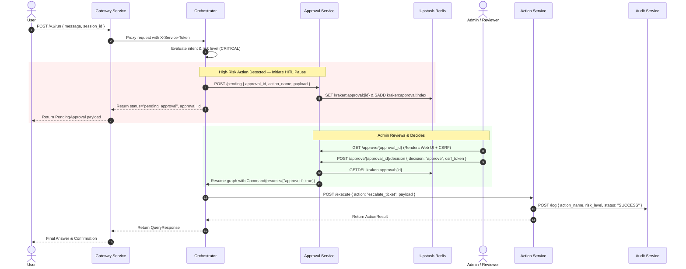

# KRAKEN Microservices Architecture

KRAKEN (Knowledge Retrieval & Autonomous Knowledge Execution Network) is a production-grade, multi-agent AI system designed for automated IT service desk operations, knowledge retrieval, and human-in-the-loop (HITL) action execution.

---

## 1. System Topology Diagram

The following diagram illustrates the microservice layout, API boundaries, and backing storage components.

---

## 2. Human-in-the-Loop (HITL) Approval Sequence Diagram

High-risk actions (such as ticket status escalation or high-severity changes) trigger a HITL pause. The execution graph yields state and awaits human review via the Approval Service.

---

## 3. Microservice Responsibilities

| Service | Port | Primary Responsibility | Backing Store |
| :--- | :--- | :--- | :--- |
| **Gateway** | 8000 | Reverse proxy, API key validation, prompt guard security filter, rate limiting. | In-memory sliding window |
| **Orchestrator** | 8001 | LangGraph agent execution loop, tool router, semantic response cache. | Qdrant & PostgreSQL (checkpoints) |
| **Knowledge** | 8002 | SLA rules and operational doc loading, embedding generation, Qdrant vector retrieval. | Qdrant Vector Cloud |
| **Action** | 8003 | Risk-classified IT action handlers (tickets, local file I/O). | PostgreSQL (`tickets`) |
| **Approval** | 8004 | Human-in-the-Loop (HITL) pause handling, CSRF-protected web review UI. | Upstash Redis |
| **Memory** | 8005 | Short-term message history buffer and long-term episodic memory storage. | Redis & PostgreSQL (`pgvector`) |
| **Audit** | 8006 | Cryptographically chained, append-only security audit log. | PostgreSQL (`audit_log`) |
